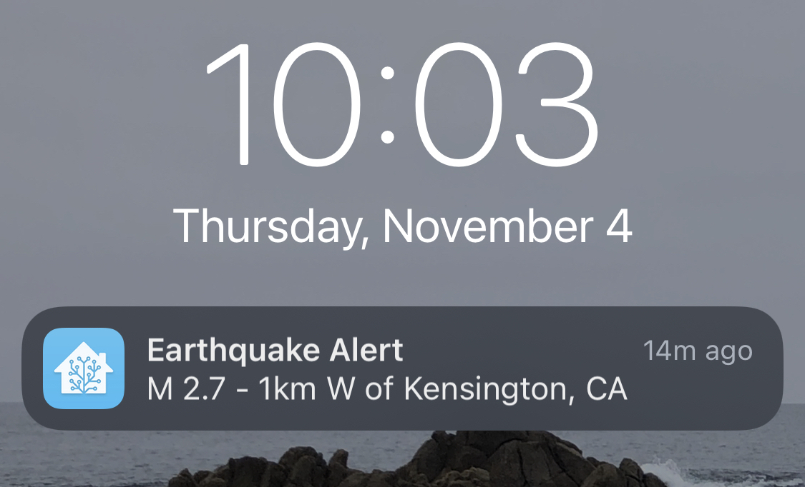

# Lighthouse

Notification system for local earthquakes from USGS and weather alerts from NWS.

## Usage

`$ ./lighthouse -config config.json`

### Config

```json
{
    "Latitude": 61.181,
    "Longitude": -149.989,
    "Distance": 500.0, // in km
    "Interval": "1m", // interval to check sources
    "Weather": {
        "Zone": "AKZ101", // NWS weather zone (https://alerts.weather.gov/index.php)
        "Email": "email@email.com" // Email for NWS API
    },
    "Mqtt": {
        "Endpoint": "tcp://homeassistant.local:1883",
        "Username": "mqtt-client",
        "Password": "fancy-password-here"
    }
}
```

### MQTT/HomeAssistant Integration

For any alert published by the monitored systems, the message will be packed into a MQTT payload for easy parsing in HomeAssistant Automation.

Example MQTT payload (earthquake):

```json
{
    "Type": "alerts/earthquakes",
    "Id": "nc73648785",
    "Message": "M 2.1 - 7km NE of San Martin, CA",
    "Link":"https://earthquake.usgs.gov/earthquakes/eventpage/nc73648785"
}
```

Example Home Assistant Automation (earthquake):



```yaml
alias: Send Push Notification for Local Earthquake Alerts
description: 'Send Push Notification for Local Earthquake Alerts'
trigger:
  - platform: mqtt
    topic: alerts/earthquakes
condition: []
action:
  - service: notify.mobile_app_<device>
    data:
      title: Earthquake Alert
      message: '{{ trigger.payload_json.Message }}'
      data:
        actions:
          - action: URI
            title: Open USGS Alert
            uri: '{{ trigger.payload_json.Link }}'
mode: parallel
max: 5
```

## Remarks

I currently run this setup on a Raspberry PI Zero and as such, I have setup some additional embedded system contraints in the design.

### DNS Pre-cached

Since the code runs on a very short interval, I cache the DNS responses for a period of time to reduce the number of out-going DNS requests. In normal cases this wouldn't be needed but I had a unique network configuration via [Tailscale](https://tailscale.com/) in which this system helped save some request latency on the small cpu of the pi.

### Notification Send Debouncing

Since an alert from either NWS or USGS could be sent multiple times, there is a cache lookup on the alert's id to only send it once. This also helps reduce the (potenial) amount of notification spam to my device.

The mechanism is a simple ring buffer that has 15 entries which adds a new entry at the end by id. On processing an alert, if the entry already exists in the buffer it will just drop the alert and not publish it to the MQTT queue. In the case that the alert is not in the buffer, it will publish the notification to the MQTT queue and add the id to the buffer at the next pointer.

Since it is a ring buffer, it means that there would need to be 15 alerts all within a short period of time for the first one to possibly be re-shown again. This helps by reducing the overall active memory usage and having to keep track of the alerts which are only every likely to report unique alerts within reasonable time periods.
